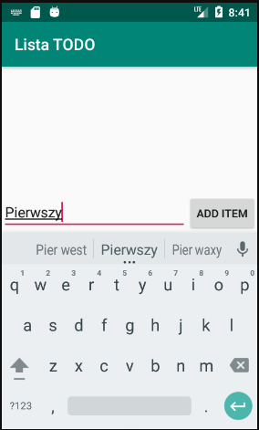
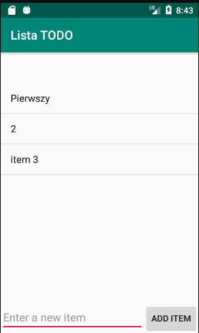
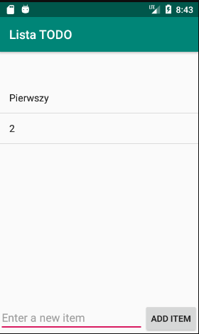

# ListaTODO
## Projekt aplikacji w systemie Android.

## Aplikacja pozwala na:
* dodawanie zadań do listy poprzez ich wpisanie
* otworzenie szczegółów w nowej aktywności poprzez kliknięcie
* usuwanie zadań z listy poprzez długie kliknięcie

## Demo:
* Dodawanie pierwszego itemu do pustej listy  

* Lista kilkuelementowa  

* Po kliknięciu na pierwszy element pokaże nam się nowy ekran ze szczegółami (tu: nazwa)  

* Element 3 usunięty po długim kliknięciu  

